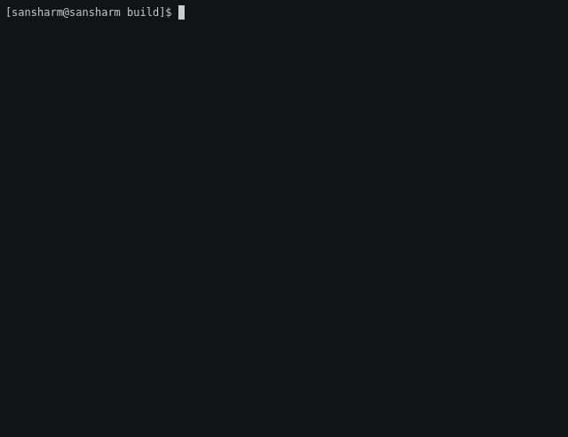

# pg-table_tests


This project consists of a suite of tools to test and verify 5-level page table
behavior on Linux.

As [documented](Documentation/x86/x86_64/5level-paging.txt) in the Linux kernel
sources, 5-level page tables boosts the virtual address space from 256 TiB
(2<sup>47</sup> bytes) to 128 PiB (2<sup>57</sup> bytes).

Since Linux splits its virtual address space between user and kernel,
applications can expect to see an increase from 128 TiB (2<sup>46</sup> bytes)
to 64 PiB (2<sup>56</sup> bytes).  However, due to backwards compatibility
concerns, this can only be achieved using the `mmap()` call with a specified
hint address above the previous 47-bit limit.

Here is an example `/proc/<pid>/maps` for a process that is utilizing virtual
address above the 47-bit range.  Each of the 1GiB `rw-p` anonymous chunks was
allocated using `mmap()` with a desired hint address:

```
address                            perms offset    dev    inode     pathname
-------------------------------------------------------------------------------------------
00400000-00401000                  r-xp  00000000  fd:00  67184873  /root/mmap
00600000-00601000                  r--p  00000000  fd:00  67184873  /root/mmap
00601000-00602000                  rw-p  00001000  fd:00  67184873  /root/mmap
00768000-00789000                  rw-p  00000000  00:00  0         [heap]
10000000000-10000001000            rw-p  00000000  00:00  0
20000000000-20000001000            rw-p  00000000  00:00  0
40000000000-40000001000            rw-p  00000000  00:00  0
80000000000-80000001000            rw-p  00000000  00:00  0
100000000000-100000001000          rw-p  00000000  00:00  0
200000000000-200000001000          rw-p  00000000  00:00  0
400000000000-400000001000          rw-p  00000000  00:00  0
7f8aa231b000-7f8aa24c7000          r-xp  00000000  fd:00  33555870  /usr/lib64/libc-2.26.so
7f8aa24c7000-7f8aa26c7000          ---p  001ac000  fd:00  33555870  /usr/lib64/libc-2.26.so
7f8aa26c7000-7f8aa26cb000          r--p  001ac000  fd:00  33555870  /usr/lib64/libc-2.26.so
7f8aa26cb000-7f8aa26cd000          rw-p  001b0000  fd:00  33555870  /usr/lib64/libc-2.26.so
7f8aa26cd000-7f8aa26d1000          rw-p  00000000  00:00  0
7f8aa26d1000-7f8aa26f6000          r-xp  00000000  fd:00  33555863  /usr/lib64/ld-2.26.so
7f8aa28eb000-7f8aa28ed000          rw-p  00000000  00:00  0
7f8aa28f5000-7f8aa28f6000          r--p  00024000  fd:00  33555863  /usr/lib64/ld-2.26.so
7f8aa28f6000-7f8aa28f7000          rw-p  00025000  fd:00  33555863  /usr/lib64/ld-2.26.so
7f8aa28f7000-7f8aa28f8000          rw-p  00000000  00:00  0
7fffd27c3000-7fffd27e4000          rw-p  00000000  00:00  0         [stack]
7fffd27fa000-7fffd27fd000          r--p  00000000  00:00  0         [vvar]
7fffd27fd000-7fffd27ff000          r-xp  00000000  00:00  0         [vdso]
800000000000-800000001000          rw-p  00000000  00:00  0
1000000000000-1000000001000        rw-p  00000000  00:00  0
2000000000000-2000000001000        rw-p  00000000  00:00  0
4000000000000-4000000001000        rw-p  00000000  00:00  0
8000000000000-8000000001000        rw-p  00000000  00:00  0
10000000000000-10000000001000      rw-p  00000000  00:00  0
20000000000000-20000000001000      rw-p  00000000  00:00  0
40000000000000-40000000001000      rw-p  00000000  00:00  0
80000000000000-80000000001000      rw-p  00000000  00:00  0
ffffffffff600000-ffffffffff601000  r-xp  00000000  00:00  0         [vsyscall]
```

Notice that the stack is still located towards the end of 4-level page table
virtual address space limit.  This memory layout suggests that `mmap()` may be
the only way for user programs to directly use the additional address space
provided by 5-level page tables.  Functions like `malloc()`, `sbrk()/brk()` and
`alloca()` that manipulate the stack/heap should be constrained to the previous
47-bit addressing limit.

## Configuration

The `run-tests` script will determine if 5-level page tables are fully supported
(see requirements in following sub-sections).  If any of the prerequisites are
not detected, `run-tests` will fall back to executing its tests with 4-level
page tables in mind.

### Processor

5-level page tables must have processor support.  This project is exercising the
x86_64 variant of Linux, therefore we are require the Intel 'la57' cpu flag:

```
% grep la57 /proc/cpuinfo | head -n1
flags           : ... snip ... la57
```

This feature may be emulated by QEMU's qemu64 cpu with the following option:
```
qemu-system-x86_64 ... -cpu qemu64,+la57
```
Note: this option is not compatible with `-enable-kvm`.

### Linux config

The Linux kernel must have 5-level page table support enabled:

```
grep CONFIG_X86_5LEVEL /boot/config-$(uname -r)
CONFIG_X86_5LEVEL=y
```

## Building

Test programs can be built using the project's Makefile:

```
% make 
cc     malloc.c   -o malloc
cc     mmap.c   -o mmap
cc     sbrk.c   -o sbrk
cc     mmap+memset+fork.c   -o mmap+memset+fork
```

`$CC` `$CFLAGS` build options may be overridden on the command line:

```
% CC=clang CFLAGS='-ggdb -Wall' make
clang -ggdb -Wall    malloc.c   -o malloc
clang -ggdb -Wall    mmap.c   -o mmap
clang -ggdb -Wall    sbrk.c   -o sbrk
clang -ggdb -Wall    mmap+memset+fork.c   -o mmap+memset+fork
```

Binaries and temporary files can be cleaned up using the `make clean` target.

For developers, shell scripts can be run through
[ShellCheck](https://github.com/koalaman/shellcheck) and C sources
through the [cppcheck](http://cppcheck.sourceforge.net/) linters using the
`make check` target.  See each program's respective webpage for installation
instructions.

## Running

Tests may be run individually (use `--help` for usage), or collectively via the
`run-tests` script.



## Tests

### malloc
### sbrk
### mmap+memset+fork.c
#### MAP_ANONYMOUS | MAP_PRIVATE
#### MAP_ANONYMOUS | MAP_SHARED
